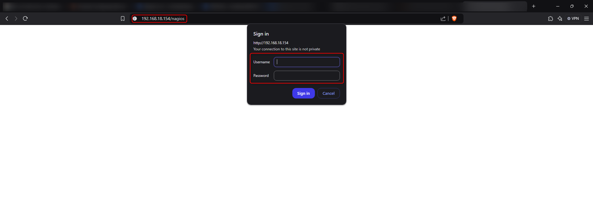
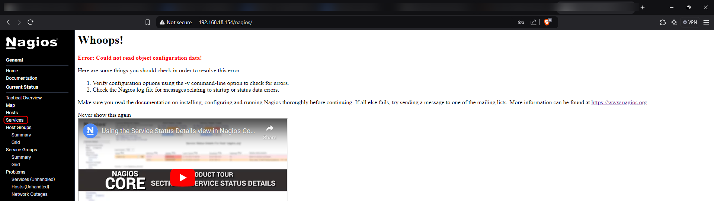
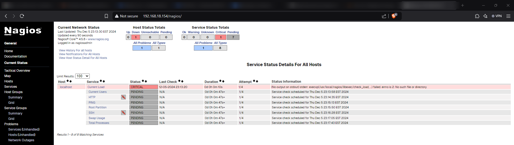

# Hello
This is note for the topic **NAGIOS**

## 1. Understanding Nagios
### a. What is it?
### b. What it can do?
### c. Why do people use it at many different scale?
## 2. Its Plugin
## 3. INSTALATION
### 3.1 Installing Nagios Core

Define your need to determinte the OS to be used. To me, it is:

```bash
[root@localhost ~]# cat /etc/os-release 
NAME="AlmaLinux"
VERSION="8.10 (Cerulean Leopard)"
ID="almalinux"
ID_LIKE="rhel centos fedora"
VERSION_ID="8.10"
PLATFORM_ID="platform:el8"
PRETTY_NAME="AlmaLinux 8.10 (Cerulean Leopard)"
ANSI_COLOR="0;34"
LOGO="fedora-logo-icon"
CPE_NAME="cpe:/o:almalinux:almalinux:8::baseos"
HOME_URL="https://almalinux.org/"
DOCUMENTATION_URL="https://wiki.almalinux.org/"
BUG_REPORT_URL="https://bugs.almalinux.org/"
ALMALINUX_MANTISBT_PROJECT="AlmaLinux-8"
ALMALINUX_MANTISBT_PROJECT_VERSION="8.10"
REDHAT_SUPPORT_PRODUCT="AlmaLinux"
REDHAT_SUPPORT_PRODUCT_VERSION="8.10"
SUPPORT_END=2029-06-01
```

This tutorial will be all in AlmaLinux.

Okay, let's move to these main step:

First, you need to disable SELinux to ensure the installing process works fine. SELinux may block some thing that you cannot be aware of it. So, better disable it when install, but in another environment, make sure that you understand what you did, like coporation lab, prod,... And ofcourse it is lab, so just basically disable it!


```bash
sed -i 's/SELINUX=.*/SELINUX=disabled/g' /etc/selinux/config
setenforce 0
```

Now you install the dependencies, using this command bellow:

```bash
dnf install -y gcc glibc glibc-common perl httpd php wget gd gd-devel
dnf install openssl-devel
dnf update -y
```

Also, it still depend on your OS, find yours at an [official Documentation](https://support.nagios.com/kb/article/nagios-core-installing-nagios-core-from-source-96.html#RHEL)


We will compile our code on /tmp . So, dowmload Nagios source code on here and extract it, you can find it in the [release part](https://github.com/NagiosEnterprises/nagioscore/releases):
```bash
cd /tmp
# The latest now is 4.5.8
wget https://github.com/NagiosEnterprises/nagioscore/releases/download/nagios-4.5.8/nagios-4.5.8.tar.gz
tar xzf nagioscore.tar.gz
```

[!] -- Not copy this part to paste to your terminal immidiately
Okay, you have done installing source code. Let's compile it!

```bash
cd /tmp/nagioscore-nagios-4.5.8/
```

Look at this :

```bash
[tpnei@localhost nagios-4.5.8]$ ls -lta | grep "Makefile"
-rw-rw-r--.  1 root root  16874 Nov 19 11:00 Makefile.in
```

In here, the configure script will take account for  defining where the file (which is used in nagios compiling process) reside, and checking for environment dependencies. The most importance is creating a Makefile. 
As you see, the folder currently does not have the Makefile (Makefile.in is different!)

Make sure that you install all the dependencies successfully
Process to the configure file:

```bash
./configure
```

It will give you the very long long output like this:

```bash
[root@localhost nagios-4.5.8]# ./configure
checking for a BSD-compatible install... /bin/install -c
checking build system type... x86_64-pc-linux-gnu
checking host system type... x86_64-pc-linux-gnu
checking for gcc... gcc
checking whether the C compiler works... yes
checking for C compiler default output file name... a.out
checking for suffix of executables...
checking whether we are cross compiling... no
checking for suffix of object files... o
checking whether the compiler supports GNU C... yes
checking whether gcc accepts -g... yes
checking for gcc option to enable C11 features... none needed
...
# The final look like
config.status: creating lib/snprintf.h
config.status: creating lib/iobroker.h

Creating sample config files in sample-config/ ...


*** Configuration summary for nagios 4.5.8 2024-11-19 ***:

 General Options:
 -------------------------
        Nagios executable:  nagios
        Nagios user/group:  nagios,nagios
       Command user/group:  nagios,nagios
             Event Broker:  yes
        Install ${prefix}:  /usr/local/nagios
    Install ${includedir}:  /usr/local/nagios/include/nagios
                Lock file:  /run/nagios.lock
   Check result directory:  /usr/local/nagios/var/spool/checkresults
           Init directory:  /lib/systemd/system
  Apache conf.d directory:  /etc/httpd/conf.d
             Mail program:  /bin/mail
                  Host OS:  linux-gnu
          IOBroker Method:  epoll

 Web Interface Options:
 ------------------------
                 HTML URL:  http://localhost/nagios/
                  CGI URL:  http://localhost/nagios/cgi-bin/
 Traceroute (used by WAP):


Review the options above for accuracy.  If they look okay,
type 'make all' to compile the main program and CGIs.
[root@localhost nagios-4.5.8]#
```
You succesfully run the configure! 

Now you should check it if the make file exist:
```bash
[tpnei@localhost nagios-4.5.8]$ ls -lta | grep "Makefile"
-rw-r--r--.  1 root root  16929 Dec  5 22:18 Makefile
-rw-rw-r--.  1 root root  16874 Nov 19 11:00 Makefile.in
[tpnei@localhost nagios-4.5.8]$ 
```
Ye, this output means your configure is success!

But if you have any buggy thing, it gonna log at config.log

```bash
[tpnei@localhost nagios-4.5.8]$ ls -lta | grep "config.log"
-rw-r--r--.  1 root root  64869 Dec  5 22:18 config.log
```

Inside you can check the value like exit to know if any bug, it is kind of :
```log
...
configure:7972: checking for gdImagePng in -lgd (order 1)
configure:7995: gcc -o conftest -g -O2 -I/usr/include/krb5     conftest.c -lgd -lttf -lpng -ljpeg -lz -lm  -lssl -lcrypto  >&5
/bin/ld: cannot find -lttf
collect2: error: ld returned 1 exit status
configure:7995: $? = 1
configure: failed program was:
...
```
There is something like exit 1. There are many reason for the bug, so If any byg, try yourself to find. (Hope you do not need to do that)

Continue, we gonna use the command below to compile all the thing defined in Makefile (The is why we should make sure that the Makefile exist!)

```bash
make all
```

The output like:
```bash
[root@localhost nagios-4.5.8]# make all
cd ./base && make
make[1]: Entering directory '/tmp/nagios-4.5.8/base'
gcc -Wall -I.. -I. -I../lib -I../include  -I../include -I..  -g -O2 -I/usr/include/krb5  -DHAVE_CONFIG_H -DNSCORE -c -o nagios.o ./nagios.c
gcc -Wall -I.. -I. -I../lib -I../include  -I../include -I..  -g -O2 -I/usr/include/krb5  -DHAVE_CONFIG_H -DNSCORE -c -o broker.o broker.c
gcc -Wall -I.. -I. -I../lib -I../include  -I../include -I..  -g -O2 -I/usr/include/krb5  -DHAVE_CONFIG_H -DNSCORE -c -o nebmods.o nebmods.c
gcc -Wall -I.. -I. -I../lib -I../include  -I../include -I..  -g -O2 -I/usr/include/krb5  -DHAVE_CONFIG_H -DNSCORE -c -o ../common/shared.o ../common/shared.c
gcc -Wall -I.. -I. -I../lib -I../include  -I../include -I..  -g -O2 -I/usr/include/krb5  -DHAVE_CONFIG_H -DNSCORE -c -o query-handler.o query-handler.c
....

# The success process will out put like this:
  make install-classicui
     - This installs the classic theme for the Nagios
       web interface


*** Support Notes *******************************************

If you have questions about configuring or running Nagios,
please make sure that you:

     - Look at the sample config files
     - Read the documentation on the Nagios Library at:
           https://library.nagios.com

before you post a question to one of the mailing lists.
Also make sure to include pertinent information that could
help others help you.  This might include:

     - What version of Nagios you are using
     - What version of the plugins you are using
     - Relevant snippets from your config files
     - Relevant error messages from the Nagios log file

For more information on obtaining support for Nagios, visit:

       https://support.nagios.com

*************************************************************

Enjoy.

```

Now we will use the make script to create user group and add user nagios to group of httpd, we will use that for our nagios GUI

```bash
[root@localhost nagios-4.5.8]# make install-groups-users
groupadd -r nagios
useradd -g nagios nagios
[root@localhost nagios-4.5.8]# usermod -a -G nagios apache
[root@localhost nagios-4.5.8]#

```

Yeah, Some first step done! You can see that there are no file created in our system

```bash
[root@localhost nagios-4.5.8]# ll /usr/local/
bin/     etc/     games/   include/ lib/     lib64/   libexec/ sbin/    share/   src/
[root@localhost nagios-4.5.8]# ll /usr/local/
```


Now, we complie all the remaining:
```bash
[root@localhost nagios-4.5.8]# make install
cd ./base && make install
make[1]: Entering directory '/tmp/nagios-4.5.8/base'
/bin/install -c -m 775 -o nagios -g nagios -d /usr/local/nagios/bin
/bin/install -c -s -m 774 -o nagios -g nagios nagios /usr/local/nagios/bin
/bin/install -c -s -m 774 -o nagios -g nagios nagiostats /usr/local/nagios/bin
make[1]: Leaving directory '/tmp/nagios-4.5.8/base'
cd ./cgi && make install
make[1]: Entering directory '/tmp/nagios-4.5.8/cgi'
make install-basic
make[2]: Entering directory '/tmp/nagios-4.5.8/cgi'
/bin/install -c -m 775 -o nagios -g nagios -d /usr/local/nagios/sbin
for file in *.cgi; do \
        /bin/install -c -s -m 775 -o nagios -g nagios $file /usr/local/nagios/sbin; \
done
make[2]: Leaving directory '/tmp/nagios-4.5.8/cgi'
make[1]: Leaving directory '/tmp/nagios-4.5.8/cgi'
cd ./html && make install

...
# The final output like:
chmod g+s /usr/local/nagios/var/spool/checkresults

*** Main program, CGIs and HTML files installed ***

You can continue with installing Nagios as follows (type 'make'
without any arguments for a list of all possible options):

  make install-init
     - This installs the init script in /lib/systemd/system

  make install-commandmode
     - This installs and configures permissions on the
       directory for holding the external command file

  make install-config
     - This installs sample config files in /usr/local/nagios/etc

make[1]: Leaving directory '/tmp/nagios-4.5.8'
```


Now it gonna appear:

```bash
[root@localhost nagios-4.5.8]# ls /usr/local/
bin  etc  games  include  lib  lib64  libexec  nagios  sbin  share  src
[root@localhost nagios-4.5.8]# ls /usr/local/nagios/
bin  libexec  sbin  share  var
[root@localhost nagios-4.5.8]#
```

This installs the service or daemon files and also configures them to start on boot. The Apache httpd service is also configured at this point.

```bash
[root@localhost nagios-4.5.8]# make install-daemoninit
/bin/install -c -m 755 -d -o root -g root /lib/systemd/system
/bin/install -c -m 755 -o root -g root startup/default-service /lib/systemd/system/nagios.service

*** Init script installed ***

[root@localhost nagios-4.5.8]# systemctl enable httpd.service
Created symlink /etc/systemd/system/multi-user.target.wants/httpd.service → /usr/lib/systemd/system/httpd.service.
[root@localhost nagios-4.5.8]#
```

This installs and configures the external command file.

```bash
[root@localhost nagios-4.5.8]# make install-commandmode
/bin/install -c -m 775 -o nagios -g nagios -d /usr/local/nagios/var/rw
chmod g+s /usr/local/nagios/var/rw

*** External command directory configured ***

[root@localhost nagios-4.5.8]#
```

Now the SAMPLE config file will be copied to the nagios.
```bash
[root@localhost nagios-4.5.8]# make install-config
/bin/install -c -m 775 -o nagios -g nagios -d /usr/local/nagios/etc
/bin/install -c -m 775 -o nagios -g nagios -d /usr/local/nagios/etc/objects
/bin/install -c -b -m 664 -o nagios -g nagios sample-config/nagios.cfg /usr/local/nagios/etc/nagios.cfg
/bin/install -c -b -m 664 -o nagios -g nagios sample-config/cgi.cfg /usr/local/nagios/etc/cgi.cfg
/bin/install -c -b -m 660 -o nagios -g nagios sample-config/resource.cfg /usr/local/nagios/etc/resource.cfg
/bin/install -c -b -m 664 -o nagios -g nagios sample-config/template-object/templates.cfg /usr/local/nagios/etc/objects/templates.cfg
/bin/install -c -b -m 664 -o nagios -g nagios sample-config/template-object/commands.cfg /usr/local/nagios/etc/objects/commands.cfg
/bin/install -c -b -m 664 -o nagios -g nagios sample-config/template-object/contacts.cfg /usr/local/nagios/etc/objects/contacts.cfg
/bin/install -c -b -m 664 -o nagios -g nagios sample-config/template-object/timeperiods.cfg /usr/local/nagios/etc/objects/timeperiods.cfg
/bin/install -c -b -m 664 -o nagios -g nagios sample-config/template-object/localhost.cfg /usr/local/nagios/etc/objects/localhost.cfg
/bin/install -c -b -m 664 -o nagios -g nagios sample-config/template-object/windows.cfg /usr/local/nagios/etc/objects/windows.cfg
/bin/install -c -b -m 664 -o nagios -g nagios sample-config/template-object/printer.cfg /usr/local/nagios/etc/objects/printer.cfg
/bin/install -c -b -m 664 -o nagios -g nagios sample-config/template-object/switch.cfg /usr/local/nagios/etc/objects/switch.cfg

*** Config files installed ***

Remember, these are *SAMPLE* config files.  You'll need to read
the documentation for more information on how to actually define
services, hosts, etc. to fit your particular needs.

[root@localhost nagios-4.5.8]#
```
This installs the Apache web server configuration files. Also configure Apache settings if required.
```bash
[root@localhost nagios-4.5.8]# make install-webconf
/bin/install -c -m 644 sample-config/httpd.conf /etc/httpd/conf.d/nagios.conf
if [ 0 -eq 1 ]; then \
        ln -s /etc/httpd/conf.d/nagios.conf /etc/apache2/sites-enabled/nagios.conf; \
fi

*** Nagios/Apache conf file installed ***

[root@localhost nagios-4.5.8]#
```

Note: In AlmaLinux firewalld is enable in default.

so, we need to configure it to see the gui through httpd by allow port 80
```bash
firewall-cmd --zone=public --add-port=80/tcp
firewall-cmd --zone=public --add-port=80/tcp --permanent
```

```bash
#The output like
[root@localhost nagios-4.5.8]# firewall-cmd --zone=public --add-port=80/tcp
anentsuccess
[root@localhost nagios-4.5.8]# firewall-cmd --zone=public --add-port=80/tcp --permanent
success
[root@localhost nagios-4.5.8]#
```

We will create nagiosadmin user account to access the GUI

```bash
[root@localhost nagios-4.5.8]# htpasswd -c /usr/local/nagios/etc/htpasswd.users nagiosadmin
New password:
Re-type new password:
Adding password for user nagiosadmin
[root@localhost nagios-4.5.8]#

# I set as "kienpt"
```

Now you can check your httpd status

```bash
[root@localhost nagios-4.5.8]# systemctl start httpd.service
[root@localhost nagios-4.5.8]#
[root@localhost nagios-4.5.8]#
[root@localhost nagios-4.5.8]#
[root@localhost nagios-4.5.8]# systemctl status httpd.service
● httpd.service - The Apache HTTP Server
   Loaded: loaded (/usr/lib/systemd/system/httpd.service; enabled; vendor preset: disabled)
  Drop-In: /usr/lib/systemd/system/httpd.service.d
           └─php-fpm.conf
   Active: active (running) since Thu 2024-12-05 23:02:16 EST; 5s ago
     Docs: man:httpd.service(8)
 Main PID: 64087 (httpd)
   Status: "Started, listening on: port 80"
    Tasks: 213 (limit: 10796)
   Memory: 23.2M
   CGroup: /system.slice/httpd.service
           ├─64087 /usr/sbin/httpd -DFOREGROUND
           ├─64094 /usr/sbin/httpd -DFOREGROUND
           ├─64095 /usr/sbin/httpd -DFOREGROUND
           ├─64096 /usr/sbin/httpd -DFOREGROUND
           └─64097 /usr/sbin/httpd -DFOREGROUND

Dec 05 23:02:16 localhost.localdomain systemd[1]: Starting The Apache HTTP Server...
Dec 05 23:02:16 localhost.localdomain httpd[64087]: AH00558: httpd: Could not reliably determine the server's fully qualified domain name, using localhost.localdomain. Set the 'ServerName' directive globally to suppress this message
Dec 05 23:02:16 localhost.localdomain systemd[1]: Started The Apache HTTP Server.
Dec 05 23:02:16 localhost.localdomain httpd[64087]: Server configured, listening on: port 80
[root@localhost nagios-4.5.8]#

# The output will be like this
```

Let's see our output


Now we click to the service part in the picture


You can see it tell no configuration file.
The reason is we have not start the nagios. So, now let's do it!

```bash
systemctl start nagios.service
```

The output like:
```bash
[root@localhost nagios-4.5.8]# systemctl start nagios.service
[root@localhost nagios-4.5.8]# systemctl status nagios.service
● nagios.service - Nagios Core 4.5.8
   Loaded: loaded (/usr/lib/systemd/system/nagios.service; enabled; vendor preset: disabled)
   Active: active (running) since Thu 2024-12-05 23:12:43 EST; 4s ago
     Docs: https://www.nagios.org/documentation
  Process: 65302 ExecStart=/usr/local/nagios/bin/nagios -d /usr/local/nagios/etc/nagios.cfg (code=exited, status=0/SUCCESS)
  Process: 65301 ExecStartPre=/usr/local/nagios/bin/nagios -v /usr/local/nagios/etc/nagios.cfg (code=exited, status=0/SUCCESS)
 Main PID: 65304 (nagios)
    Tasks: 6 (limit: 10796)
   Memory: 5.9M
   CGroup: /system.slice/nagios.service
           ├─65304 /usr/local/nagios/bin/nagios -d /usr/local/nagios/etc/nagios.cfg
           ├─65305 /usr/local/nagios/bin/nagios --worker /usr/local/nagios/var/rw/nagios.qh
           ├─65306 /usr/local/nagios/bin/nagios --worker /usr/local/nagios/var/rw/nagios.qh
           ├─65307 /usr/local/nagios/bin/nagios --worker /usr/local/nagios/var/rw/nagios.qh
           ├─65308 /usr/local/nagios/bin/nagios --worker /usr/local/nagios/var/rw/nagios.qh
           └─65309 /usr/local/nagios/bin/nagios -d /usr/local/nagios/etc/nagios.cfg

Dec 05 23:12:43 localhost.localdomain nagios[65304]: qh: core query handler registered
Dec 05 23:12:43 localhost.localdomain nagios[65304]: qh: echo service query handler registered
Dec 05 23:12:43 localhost.localdomain nagios[65304]: qh: help for the query handler registered
Dec 05 23:12:43 localhost.localdomain nagios[65304]: wproc: Successfully registered manager as @wproc with query handler
Dec 05 23:12:43 localhost.localdomain nagios[65304]: wproc: Registry request: name=Core Worker 65305;pid=65305
Dec 05 23:12:43 localhost.localdomain nagios[65304]: wproc: Registry request: name=Core Worker 65306;pid=65306
Dec 05 23:12:43 localhost.localdomain nagios[65304]: wproc: Registry request: name=Core Worker 65307;pid=65307
Dec 05 23:12:43 localhost.localdomain nagios[65304]: wproc: Registry request: name=Core Worker 65308;pid=65308
Dec 05 23:12:45 localhost.localdomain nagios[65304]: Successfully launched command file worker with pid 65309
Dec 05 23:12:45 localhost.localdomain nagios[65304]: HOST ALERT: localhost;DOWN;SOFT;1;(No output on stdout) stderr: execvp(/usr/local/nagios/libexec/check_ping, ...) failed. errno is 2: No such file or directory
[root@localhost nagios-4.5.8]#
```

Yes, we can see out result now.



At this point, we can temporariy conclude that we have done installing Nagios. But, we still cannot use it yet!

The next point:

Setup plugin
Setup command
Setup our custom command
Setup alert
