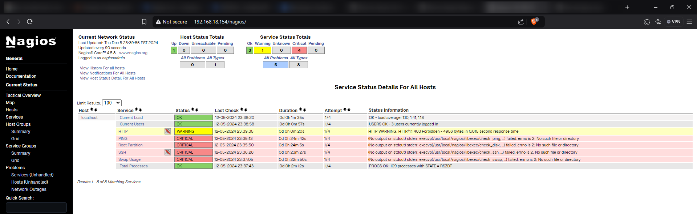

# Setup Plugin


Now first we install the dependencies

```bash
yum install -y gcc glibc glibc-common make gettext automake autoconf wget openssl-devel net-snmp net-snmp-utils
```
The output like:

```log
[root@localhost nagios-4.5.8]# yum install -y gcc glibc glibc-common make gettext automake autoconf wget openssl-devel net-snmp net-snmp-utils
Last metadata expiration check: 0:42:39 ago on Thu 05 Dec 2024 10:39:03 PM EST.
Package gcc-8.5.0-22.el8_10.x86_64 is already installed.
Package glibc-2.28-251.el8_10.5.x86_64 is already installed.
Package glibc-common-2.28-251.el8_10.5.x86_64 is already installed.
Package make-1:4.2.1-11.el8.x86_64 is already installed.
Package gettext-0.19.8.1-17.el8.x86_64 is already installed.
Package wget-1.19.5-12.el8_10.x86_64 is already installed.
Package openssl-devel-1:1.1.1k-14.el8_6.x86_64 is already installed.
...
...
...
  Verifying        : net-snmp-agent-libs-1:5.8-30.el8.x86_64                                                                                                                                                                                                                                                          8/9
  Verifying        : net-snmp-utils-1:5.8-30.el8.x86_64                                                                                                                                                                                                                                                               9/9

Installed:
  autoconf-2.69-29.el8_10.1.noarch    automake-1.16.1-8.el8.noarch  lm_sensors-libs-3.4.0-23.20180522git70f7e08.el8.x86_64  m4-1.4.18-7.el8.x86_64  mariadb-connector-c-3.1.11-2.el8_3.x86_64  mariadb-connector-c-config-3.1.11-2.el8_3.noarch  net-snmp-1:5.8-30.el8.x86_64  net-snmp-agent-libs-1:5.8-30.el8.x86_64
  net-snmp-utils-1:5.8-30.el8.x86_64

Complete!
```

Yes, dependencies available!

Now we install the plugin source. Once more, choose the version that fit your need.
```bash
wget --no-check-certificate -O nagios-plugins.tar.gz https://github.com/nagios-plugins/nagios-plugins/releases/download/release-x.x.xx/nagios-plugins-x.x.xx.tar.gz
tar zxf nagios-plugins.tar.gz
cd nagios-plugins-x.x.xx/
```

Now it the same as the last installation, we also use the build-in script to extract also compiling code.
```bash
cd /tmp/nagios-plugins-release-2.4.6/
./tools/setup
```
the output like
```log
[root@localhost nagios-plugins-release-2.4.6]# ./tools/setup
/usr/bin/which: no gnumake in (/sbin:/bin:/usr/sbin:/usr/bin)
Found GNU Make at /bin/gmake ... good.
configure.ac:46: installing 'build-aux/compile'
configure.ac:12: installing 'build-aux/config.guess'
configure.ac:12: installing 'build-aux/config.sub'
configure.ac:9: installing 'build-aux/install-sh'
configure.ac:9: installing 'build-aux/missing'
Makefile.am: installing './INSTALL'
gl/Makefile.am: installing 'build-aux/depcomp'
parallel-tests: installing 'build-aux/test-driver'
[root@localhost nagios-plugins-release-2.4.6]#
```

Continue, we will execute the configure file:

```bash
[root@localhost nagios-plugins-release-2.4.6]# ./configure
checking for a BSD-compatible install... /bin/install -c
checking whether build environment is sane... yes
checking for a thread-safe mkdir -p... /bin/mkdir -p
checking for gawk... gawk
checking whether make sets $(MAKE)... yes
checking whether make supports nested variables... yes
checking whether to enable maintainer-specific portions of Makefiles... yes
# at here it will define a tons of thing for the compiling process
....
....
config.status: creating pkg/solaris/pkginfo
config.status: creating po/Makefile.in
config.status: creating config.h
config.status: config.h is unchanged
config.status: executing depfiles commands
config.status: executing libtool commands
config.status: executing po-directories commands
config.status: creating po/POTFILES
config.status: creating po/Makefile  ---------> Focus on this
```
As it say in the last line, we have the Makefile in the po folder

```log
[root@localhost nagios-plugins-release-2.4.6]# ls po
ChangeLog  de.po  fr.po  LINGUAS  Makefile  Makefile.in  Makefile.in.in  Makevars  nagios-plugins.pot  POTFILES  POTFILES.in  remove-potcdate.sin
[root@localhost nagios-plugins-release-2.4.6]#
```

Continue we type "make" like the last session that I have mentioned:

```bash
[root@localhost nagios-plugins-release-2.4.6]# make
make  all-recursive
make[1]: Entering directory '/tmp/nagios-plugins-release-2.4.6'
Making all in gl
make[2]: Entering directory '/tmp/nagios-plugins-release-2.4.6/gl'
rm -f alloca.h-t alloca.h && \
{ echo '/* DO NOT EDIT! GENERATED AUTOMATICALLY! */'; \
  cat ./alloca.in.h; \
} > alloca.h-t && \
mv -f alloca.h-t alloca.h
rm -f c++defs.h-t c++defs.h && \
sed -n -e '/_GL_CXXDEFS/,$p' \
  < ../build-aux/snippet/c++defs.h \
  > c++defs.h-t && \

```
Maybe it totally confuse that you if it is success or not, but some kind of Compiler warning flag will appear, but it just appear! If you Output like this, you may success.

```bash
.......
make[2]: Entering directory '/tmp/nagios-plugins-release-2.4.6/po'
test ! -f ./nagios-plugins.pot || \
  test -z "fr.gmo de.gmo" || make fr.gmo de.gmo
make[3]: Entering directory '/tmp/nagios-plugins-release-2.4.6/po'
cd . && rm -f fr.gmo && /bin/msgfmt -c --statistics -o t-fr.gmo fr.po && (mv t-fr.gmo fr.gmo 2>/dev/null || true)
fr.po:10: warning: header field 'Language' still has the initial default value
761 translated messages, 125 fuzzy translations, 560 untranslated messages.
cd . && rm -f de.gmo && /bin/msgfmt -c --statistics -o t-de.gmo de.po && (mv t-de.gmo de.gmo 2>/dev/null || true)
71 translated messages, 208 fuzzy translations, 1167 untranslated messages.
make[3]: Leaving directory '/tmp/nagios-plugins-release-2.4.6/po'
touch stamp-po
make[2]: Leaving directory '/tmp/nagios-plugins-release-2.4.6/po'
make[2]: Entering directory '/tmp/nagios-plugins-release-2.4.6'
make[2]: Leaving directory '/tmp/nagios-plugins-release-2.4.6'
make[1]: Leaving directory '/tmp/nagios-plugins-release-2.4.6'
[root@localhost nagios-plugins-release-2.4.6]#

```

And, 'make install'

```log
the out put like

/bin/mkdir -p /usr/local/nagios/share
installing fr.gmo as /usr/local/nagios/share/locale/fr/LC_MESSAGES/nagios-plugins.mo
installing de.gmo as /usr/local/nagios/share/locale/de/LC_MESSAGES/nagios-plugins.mo
if test "nagios-plugins" = "gettext-tools"; then \
  /bin/mkdir -p /usr/local/nagios/share/gettext/po; \
  for file in Makefile.in.in remove-potcdate.sin    Makevars.template; do \
    /bin/install -c  -m 644 ./$file \
                    /usr/local/nagios/share/gettext/po/$file; \
  done; \
  for file in Makevars; do \
    rm -f /usr/local/nagios/share/gettext/po/$file; \
  done; \
else \
  : ; \
fi
make[1]: Leaving directory '/tmp/nagios-plugins-release-2.4.6/po'
make[1]: Entering directory '/tmp/nagios-plugins-release-2.4.6'
make[2]: Entering directory '/tmp/nagios-plugins-release-2.4.6'
make[2]: Nothing to be done for 'install-exec-am'.
make[2]: Nothing to be done for 'install-data-am'.
make[2]: Leaving directory '/tmp/nagios-plugins-release-2.4.6'
make[1]: Leaving directory '/tmp/nagios-plugins-release-2.4.6'
```

Only We have done this step, our plugin will automatically place as where it should be (You can read the Makefile in detail to understand how the makefile define)
Let's check our things.
